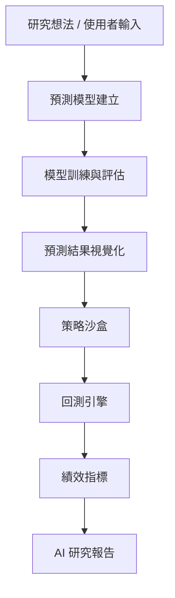

# 🤖 AI Quant Research Sandbox  
### 從研究想法到預測模型、策略回測與 AI 報告的一體化研究沙盒

線上 demo 網址：https://ai-quant-research-sandbox-with-an-auto-code-generation-feature.streamlit.app/

> 一個結合 **機器學習預測、量化回測與 AI 報告生成** 的台股研究平台，用來將分散的研究步驟整合成可重複、可展示的研究流程。

> [!IMPORTANT]
> **本專案僅供研究與展示用途。**
> - **LLM 限制**：目前展示使用的是免費級別的 LLM API (如 Groq)，若短時間內頻繁調用 Agent 功能，可能會觸發 **Rate Limit (呼叫次數限制)**。若發生報錯，請稍等片刻再試。
> - 本專案非投資建議，不保證獲利。


---

## 專案背景

在量化研究或資料分析情境中，一個研究想法通常需要經過多個步驟才能驗證，包括資料處理、特徵工程、模型訓練、績效評估、策略回測，以及最後的結果整理。這些步驟常分散在不同工具與腳本之中，不僅提高實作門檻，也讓研究流程難以快速重複與展示。

本專案的出發點，是希望建立一個整合式研究環境，讓使用者能更快地把「研究想法」轉換為「可驗證的模型與策略結果」，並透過視覺化與 AI 報告降低理解門檻。

本系統定位為 **研究沙盒（Research Sandbox）**，而非交易系統。重點不在保證獲利，而在於讓研究流程更清楚、更完整，也更容易被驗證與溝通。

---

## 核心流程

整體流程如下：

1. 使用者設定研究題目或輸入自然語言需求  
2. 系統建立預測模型並完成評估  
3. 將模型訊號或技術指標轉為策略  
4. 執行回測並產出績效指標  
5. 自動整理為 AI 研究報告  



---

## 主要功能

### 1. Forecast Builder：預測模型建立與評估

支援使用者設定股票、日期區間、預測任務與模型類型，自動完成：

* 資料取得與前處理
* 技術指標與特徵工程
* 預測模型訓練
* 測試集評估
* 預測結果視覺化

目前支援的模型包含：

* Linear Regression
* XGBoost
* LightGBM

主要評估指標包含：

* RMSE
* MAE
* R²
* Directional Accuracy

---

### 2. Strategy Sandbox：策略回測

將預測結果或技術指標轉換為可測試的交易邏輯，並進行回測。

目前支援：

* Moving Average Cross
* RSI Mean Reversion
* Prediction-based Strategy

回測結果包含：

* Total Return
* Annualized Return
* Sharpe Ratio
* Max Drawdown
* Win Rate
* Buy & Hold 比較

系統同時納入台股交易成本假設，例如手續費與交易稅，使結果更接近真實市場情境。

---

### 3. AI Report：研究報告生成

系統會將模型與回測結果整理為結構化摘要，並進一步生成研究報告。

支援兩種模式：

* **Template 模式**：以規則模板整理研究結果
* **LLM 模式**：若提供 API Key，則使用 LLM 將結果轉為自然語言分析

報告內容通常包含：

* 執行摘要
* 研究設定
* 模型結果分析
* 策略回測分析
* 風險與限制
* 結論

---

### 4. Agent Model Builder：自然語言驅動的研究流程

除了表單式操作外，系統也提供 demo 用的 Agent 頁面，讓使用者可直接輸入自然語言需求，系統再自動解析、建模、評估、回測並生成報告。

若執行過程出現常見錯誤，系統會透過受控的 fallback 機制自動修正設定並重試，以提高整體流程成功率。

這個功能主要展示的是：如何把原本需要分段操作的研究流程，進一步包裝成更接近 AI workflow 的互動體驗。

---

## 專案價值

本專案的價值不只是建立模型或回測策略，而是把原本分散的資料分析、建模、驗證與結果解讀流程，整合成一個更完整的研究工作流。它同時結合了資料科學的基本方法、量化研究的驗證邏輯，以及 AI 在結果解讀與流程自動化上的應用，讓整個研究過程更容易重複、展示與溝通。

---

## 專案結構

```text
app/               Streamlit 介面與互動頁面
src/agent/         Agent workflow、prompt 解析與自動修正
src/data/          資料取得、清洗與特徵工程
src/models/        模型訓練、驗證與評估
src/backtest/      向量化回測引擎
src/report/        AI 報告與摘要生成
artifacts/         圖表、模型與報告輸出
```

---

## 快速開始

### 1. 安裝套件

```bash
pip install -r requirements.txt
```

### 2. 啟動系統

```bash
python run_app.py
```

### 3. 啟用 AI 功能（選用）

若要使用 LLM 報告或 Agent 功能，可設定 API Key：

```bash
OPENAI_API_KEY=your_key
```

或

```bash
GROQ_API_KEY=your_key
```

---

## 使用方式

一個典型流程如下：

1. 選擇股票與預測任務
2. 訓練模型並查看評估結果
3. 將訊號轉為策略並執行回測
4. 生成研究報告

若使用 Agent 頁面，則可直接以自然語言描述需求，系統會自動串接上述流程。

---

## 專案限制

本專案目前仍以研究與展示為主，限制包括：

* 主要以單一股票研究為主
* 不包含投資組合最佳化
* 市場假設相對簡化
* 模型搜尋空間有限

因此本系統適合作為研究原型與作品展示，不適合作為正式交易系統。

---

## 未來擴展方向

後續可進一步擴充：

* 多資產投資組合回測
* 自動化特徵搜尋
* 超參數最佳化
* 更完整的 Agent orchestration
* 更強的報告與解釋能力

---

## 免責聲明

本專案僅供研究與展示用途，不構成任何投資建議，也不保證投資績效。
